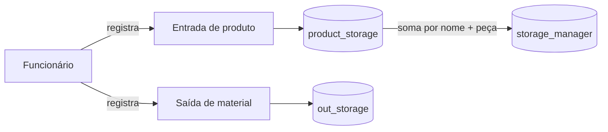

# Aghata Escada API

API REST para gestão de almoxarifado, criada para registrar funcionários, entradas de produtos, posição consolidada do estoque e saídas de materiais. O projeto está em desenvolvimento e tem como visão futura evoluir de um controle de estoque para uma plataforma operacional com recursos de CRM.

> Status: em desenvolvimento. A API já inicializa e possui os fluxos descritos abaixo, mas ainda existem regras de estoque e segurança que precisam ser concluídas antes do uso em produção.

## Sumário

- [O que o projeto já faz](#o-que-o-projeto-já-faz)
- [Como o domínio funciona hoje](#como-o-domínio-funciona-hoje)
- [Tecnologias](#tecnologias)
- [Arquitetura e organização](#arquitetura-e-organização)
- [Como executar](#como-executar)
- [Swagger e banco H2](#swagger-e-banco-h2)
- [Autenticação](#autenticação)
- [Rotas disponíveis](#rotas-disponíveis)
- [Exemplos de uso](#exemplos-de-uso)
- [Tratamento de erros](#tratamento-de-erros)
- [Estado atual e limitações conhecidas](#estado-atual-e-limitações-conhecidas)
- [Visão de futuro](#visão-de-futuro)
- [Como contribuir](#como-contribuir)

## O que o projeto já faz

### Funcionários

- Cadastra funcionários com nome, cargo, número de CLT, setor e senha.
- Impede o cadastro duplicado do número de CLT.
- Armazena senhas com hash BCrypt.
- Define `ROLE_USER` como perfil padrão no cadastro.
- Lista funcionários e consulta um funcionário por UUID.
- Atualiza os dados cadastrais.
- Permite redefinir a senha após conferir a senha atual.
- Remove funcionários.
- Possui os perfis `ROLE_USER` e `ROLE_ADMIN`.

### Autenticação e autorização

- Realiza login com número de CLT e senha.
- Emite um JWT contendo o ID, nome e perfil do funcionário.
- Lê tokens enviados no cabeçalho `Authorization: Bearer <token>`.
- Valida assinatura, funcionário e expiração do token.
- Retorna respostas JSON próprias para acessos não autenticados (`401`) ou sem permissão (`403`).
- Restringe a listagem e a consulta de funcionários ao perfil `ROLE_ADMIN`.

### Entrada de produtos

- Registra uma entrada de produto associada ao funcionário responsável.
- Armazena nome, código da peça, quantidade, status e datas de criação/atualização.
- Inicia novos registros com status `USABLE`.
- Lista todas as entradas e consulta uma entrada por UUID.
- Atualiza os dados de uma entrada.
- Permite marcar uma entrada como `UNUSABLE`.
- Rejeita quantidades negativas e algumas combinações inconsistentes de nome/código.

### Estoque consolidado

- Soma as quantidades das entradas pelo par `nome + código da peça`.
- Mantém uma tabela de visão gerencial chamada `storage_manager`.
- Lista os produtos consolidados e consulta um item por UUID.
- Pesquisa itens pelo nome exato.
- Permite atualizar e excluir registros da visão gerencial.
- Mantém status e datas de criação/atualização do consolidado.

### Saída de materiais

- Registra uma saída associada ao funcionário responsável.
- Armazena nome do produto, código da peça e quantidade informada.
- Lista o histórico de saídas e consulta uma saída por UUID.
- Valida a presença dos campos obrigatórios.

### Infraestrutura da API

- Documentação interativa com OpenAPI/Swagger UI.
- Persistência com Spring Data JPA.
- H2 em memória configurado como banco padrão de desenvolvimento.
- Driver MySQL disponível para uma futura configuração persistente.
- Validação de DTOs com Jakarta Validation.
- Tratamento global para erros de validação, regras de negócio, conflitos e recursos não encontrados.
- Teste de carregamento do contexto Spring.

## Como o domínio funciona hoje



O funcionário é relacionado às entradas e às saídas que registrou. A tabela gerencial recebe um resumo das entradas cadastradas. Atualmente, a saída é um histórico independente: ela ainda não possui relacionamento com o produto e não reduz automaticamente o saldo consolidado.

### Principais tabelas

| Tabela | Responsabilidade |
| --- | --- |
| `employees` | Funcionários, credenciais, perfil e datas cadastrais |
| `product_storage` | Registros individuais de entrada de produtos |
| `storage_manager` | Quantidade consolidada por produto/peça |
| `out_storage` | Histórico das saídas registradas |

## Tecnologias

| Tecnologia | Uso no projeto |
| --- | --- |
| Java 21 | Linguagem e versão de compilação |
| Spring Boot 4.1.0 | Base da aplicação |
| Spring Web MVC | API REST |
| Spring Data JPA / Hibernate | Persistência e consultas |
| Spring Security | Autenticação e autorização |
| JJWT 0.12.6 | Criação e validação de JWT |
| BCrypt | Hash de senhas |
| Jakarta Validation | Validação dos corpos de requisição |
| H2 | Banco em memória para desenvolvimento e testes |
| MySQL Connector | Driver disponível para futura configuração MySQL |
| Springdoc OpenAPI 3.0.3 | OpenAPI e Swagger UI |
| Lombok | Redução de código repetitivo |
| Maven / Maven Wrapper | Build e gerenciamento de dependências |
| JUnit / Spring Boot Test | Testes automatizados |

O projeto também inclui o Spring Cloud OpenFeign como dependência, mas ainda não possui clientes HTTP externos implementados.

## Arquitetura e organização

O código está organizado por funcionalidade. Dentro de cada módulo aparecem as camadas de controller, service, repository, entity, DTO, mapper e validação conforme a necessidade.

```text
src/main/java/br/costa/AghataEscada
├── config/             # Spring Security e encoder de senha
├── epmloyeer/          # Funcionários
├── exception/          # Exceções e tratamento global
├── managerstorage/     # Visão consolidada do estoque
├── outstorage/         # Histórico de saídas
├── productstorage/     # Entradas de produtos
└── security/           # Login, JWT e filtro de autenticação
```

Fluxo usual de uma requisição:

```text
Controller → Service → Validator/Creator/Mapper → Repository → Banco de dados
```

Os nomes `epmloyeer`, `ProdutcStorageService`, `ManagerStoragerController` e `PasswordConifg` refletem o código atual. Padronizar esses nomes sem quebrar os pacotes existentes é uma tarefa de refatoração prevista.

## Como executar

### Pré-requisitos

- JDK 21 ou superior compatível com o nível de compilação Java 21.
- Git.
- Não é necessário instalar o Maven se for utilizado o Maven Wrapper incluído no repositório.

### 1. Clonar e entrar no projeto

```bash
git clone <URL_DO_REPOSITORIO>
cd AghataEscada
```

### 2. Definir o segredo do JWT

A propriedade `jwt.secret` utiliza a variável de ambiente obrigatória `JWT_SECRET`. O valor deve ser uma chave forte codificada em Base64.

PowerShell:

```powershell
$jwtBytes = New-Object byte[] 32
[System.Security.Cryptography.RandomNumberGenerator]::Fill($jwtBytes)
$env:JWT_SECRET = [Convert]::ToBase64String($jwtBytes)
```

Linux/macOS com OpenSSL:

```bash
export JWT_SECRET="$(openssl rand -base64 32)"
```

Nunca envie o segredo real para o Git.

### 3. Iniciar a aplicação

Windows:

```powershell
.\mvnw.cmd spring-boot:run
```

Linux/macOS:

```bash
./mvnw spring-boot:run
```

A API será iniciada, por padrão, em `http://localhost:8080`.

### 4. Executar os testes

Windows:

```powershell
.\mvnw.cmd test
```

Linux/macOS:

```bash
./mvnw test
```

## Swagger e banco H2

Com a aplicação em execução:

| Recurso | Endereço |
| --- | --- |
| Swagger UI | `http://localhost:8080/swagger-ui.html` |
| Especificação OpenAPI JSON | `http://localhost:8080/v3/api-docs` |
| Console H2 | `http://localhost:8080/h2-console` |

Dados para acessar o H2:

```text
JDBC URL: jdbc:h2:mem:testdb
Usuário: sa
Senha: deixe em branco
```

O banco padrão é temporário. Como o projeto usa H2 em memória e `ddl-auto: create-drop`, os dados são recriados quando a aplicação reinicia.

## Autenticação

O login utiliza o número de CLT como identificador do usuário.

```http
POST /auth/login
Content-Type: application/json

{
  "cltNumber": "12345",
  "password": "minha-senha"
}
```

Resposta:

```json
{
  "name": "Maria Silva",
  "cltNumber": "12345",
  "token": "eyJhbGciOi..."
}
```

Para rotas protegidas, envie:

```http
Authorization: Bearer eyJhbGciOi...
```

### Acesso configurado atualmente

| Grupo | Acesso atual |
| --- | --- |
| Swagger, OpenAPI e console H2 | Público |
| Login e cadastro de funcionário | Público |
| Consulta de funcionários | Somente `ROLE_ADMIN` |
| Requisições `PUT` e `PATCH` | Públicas pela configuração global atual |
| Rotas implementadas de produtos | Públicas |
| Rotas gerenciais, exceto exclusão | Públicas |
| Saídas de estoque | Qualquer usuário autenticado |
| Exclusão de funcionário e item gerencial | Qualquer usuário autenticado |

Essa política facilita o desenvolvimento, mas é permissiva demais para produção. O endurecimento das permissões faz parte das prioridades do projeto.

## Rotas disponíveis

Os UUIDs apresentados como `{id}`, `{employeeId}`, `{empId}` e `{prodId}` devem ser substituídos por IDs reais.

### Autenticação

| Método | Rota | Descrição | Acesso |
| --- | --- | --- | --- |
| `POST` | `/auth/login` | Autentica pelo número de CLT e retorna um JWT | Público |

### Funcionários

| Método | Rota | Descrição | Acesso atual |
| --- | --- | --- | --- |
| `POST` | `/v1/employer/register` | Cadastra um funcionário | Público |
| `GET` | `/v1/employer` | Lista funcionários | `ROLE_ADMIN` |
| `GET` | `/v1/employer/{id}` | Consulta funcionário por UUID | `ROLE_ADMIN` |
| `PUT` | `/v1/employer/{id}` | Atualiza os dados cadastrais | Público |
| `PATCH` | `/v1/employer/{id}` | Redefine a senha | Público |
| `DELETE` | `/v1/employer/{id}` | Exclui o funcionário | Autenticado |

### Entradas de produtos

| Método | Rota | Descrição | Acesso atual |
| --- | --- | --- | --- |
| `POST` | `/v1/product/{employeeId}` | Registra uma entrada para o funcionário | Público |
| `GET` | `/v1/product` | Lista todas as entradas | Público |
| `GET` | `/v1/product/{id}` | Consulta uma entrada por UUID | Público |
| `PUT` | `/v1/product/{empId}/product/{prodId}` | Atualiza uma entrada | Público |
| `PATCH` | `/v1/product/{empId}/product/{prodId}` | Altera o status para `UNUSABLE` | Público |

### Estoque consolidado

| Método | Rota | Descrição | Acesso atual |
| --- | --- | --- | --- |
| `GET` | `/v1/manager` | Lista o saldo consolidado | Público |
| `GET` | `/v1/manager/{id}` | Consulta um item consolidado | Público |
| `POST` | `/v1/manager` | Pesquisa pelo nome exato enviado no corpo | Público |
| `PUT` | `/v1/manager/{id}` | Atualiza um item consolidado | Público |
| `DELETE` | `/v1/manager/{id}` | Exclui um item consolidado | Autenticado |

### Saídas de materiais

| Método | Rota | Descrição | Acesso atual |
| --- | --- | --- | --- |
| `POST` | `/v1/out-storage/{employeeId}` | Registra uma saída para o funcionário | Autenticado |
| `GET` | `/v1/out-storage` | Lista as saídas | Autenticado |
| `GET` | `/v1/out-storage/{id}` | Consulta uma saída por UUID | Autenticado |

## Exemplos de uso

### Cadastrar um funcionário

```http
POST /v1/employer/register
Content-Type: application/json

{
  "name": "Maria Silva",
  "position": "Almoxarife",
  "cltNumber": "12345",
  "sector": "Estoque",
  "password": "minha-senha"
}
```

Todo funcionário criado por essa rota recebe inicialmente `ROLE_USER`.

### Registrar uma entrada

```http
POST /v1/product/2df1ff40-3a69-4bec-b6bf-04a42cf860b8
Content-Type: application/json

{
  "name": "Degrau",
  "part": "DEG-001",
  "quantity": 20
}
```

A resposta contém os dados da entrada, seu UUID, status e o funcionário responsável. Depois do cadastro, o serviço recalcula o resumo da tabela gerencial.

### Consultar o estoque consolidado

```http
GET /v1/manager
```

Exemplo de resposta:

```json
[
  {
    "id": "5cad376c-6575-4106-bca0-839d585ac856",
    "nameProduct": "Degrau",
    "productQuantity": 20,
    "productPart": "DEG-001",
    "status": "USABLE",
    "createdAt": "2026-08-05",
    "updatedAt": "2026-08-05"
  }
]
```

### Pesquisar um produto consolidado por nome

```http
POST /v1/manager
Content-Type: application/json

{
  "nameProduct": "Degrau"
}
```

A pesquisa atual é por nome exato. Quando nenhum registro é encontrado, a API retorna `404`.

### Registrar uma saída

```http
POST /v1/out-storage/2df1ff40-3a69-4bec-b6bf-04a42cf860b8
Authorization: Bearer <TOKEN>
Content-Type: application/json

{
  "nameOutStorage": "Degrau",
  "partOutStorage": "DEG-001",
  "quantityOutStorage": "2"
}
```

No modelo atual, `quantityOutStorage` é texto e a operação apenas cria o histórico da saída. Ela ainda não valida nem desconta a quantidade disponível.

## Tratamento de erros

A API centraliza erros de domínio e validação em `GlobalExceptionHandler`.

| Situação | Status HTTP |
| --- | --- |
| Corpo inválido ou regra de negócio inválida | `400 Bad Request` |
| Recurso não encontrado | `404 Not Found` |
| Duplicidade ou conflito | `409 Conflict` |
| Falta de autenticação | `401 Unauthorized` |
| Falta de permissão | `403 Forbidden` |

Exemplo de erro:

```json
{
  "timestamp": "2026-08-05T20:30:00",
  "status": 404,
  "erro": "Ressource not found",
  "message": "product not found",
  "path": "/v1/manager/5cad376c-6575-4106-bca0-839d585ac856",
  "errors": null
}
```

Em erros de validação, `errors` contém a lista de campos e suas respectivas mensagens.

## Estado atual e limitações conhecidas

Esta seção evita que usuários e colaboradores confundam comportamento existente com comportamento planejado.

- A saída de material não está ligada por chave estrangeira ao produto.
- Registrar uma saída ainda não verifica saldo, não impede estoque negativo e não desconta a quantidade armazenada.
- A quantidade de saída é armazenada como `String`; o domínio de estoque deve utilizar um tipo numérico.
- A tabela gerencial é sincronizada após a criação de uma entrada, mas não é recalculada após todos os tipos de alteração.
- O consolidado é persistido em uma segunda tabela, o que exige cuidado para evitar divergência em relação às entradas.
- O banco padrão é H2 em memória e perde os dados ao reiniciar.
- O driver MySQL está presente, mas ainda não há um perfil de produção configurado.
- As permissões atuais deixam produtos, alterações `PUT`/`PATCH`, Swagger e H2 públicos.
- O cadastro sempre cria `ROLE_USER`; ainda não existe um fluxo administrativo para promover usuários com segurança.
- A busca gerencial usa `POST` e correspondência exata, sem paginação.
- Ainda não existem migrações versionadas de banco de dados.
- A cobertura automatizada atual verifica apenas o carregamento do contexto Spring.
- Alguns nomes de pacotes/classes possuem erros de grafia e devem ser refatorados de maneira controlada.
- Ainda não há frontend, containerização, pipeline de CI/CD ou observabilidade.

## Visão de futuro

A direção natural do projeto é transformar o protótipo atual em uma fonte confiável para todas as movimentações do almoxarifado e, depois, conectar essas movimentações aos processos comerciais e operacionais de um CRM.

Um fluxo futuro possível seria:

```text
Compra/recebimento
        ↓
Entrada e conferência
        ↓
Saldo disponível por produto e localização
        ↓
Requisição, reserva e aprovação
        ↓
Saída rastreável por funcionário, serviço ou cliente
        ↓
Indicadores, alertas e histórico no CRM
```

### Fase 1 — Estoque confiável

- Separar claramente cadastro de produto, lotes/entradas e movimentações.
- Fazer a saída receber o ID do produto e apenas a quantidade digitada pelo usuário.
- Usar quantidade numérica e validar valores maiores que zero.
- Verificar o saldo e descontá-lo em uma transação atômica.
- Impedir estoque negativo e tratar concorrência entre saídas simultâneas.
- Atualizar ou derivar o consolidado sem risco de divergência.
- Criar histórico imutável de entradas, saídas, ajustes e responsáveis.
- Introduzir Flyway ou Liquibase para versionar o banco.
- Criar testes unitários, de integração, segurança e regras de estoque.

### Fase 2 — Operação do almoxarifado

- Paginação, ordenação e filtros por nome, peça, status e período.
- Estoque mínimo e alertas de reposição.
- Múltiplos depósitos, corredores, prateleiras e localizações.
- Reserva de materiais e fluxo de aprovação.
- Leitura de código de barras ou QR Code.
- Inventário e ajustes com justificativa.
- Relatórios de consumo, movimentação e produtos sem giro.
- Dashboard para visão de saldo, entradas, saídas e itens críticos.
- Importação e exportação em CSV/Excel.

### Fase 3 — Evolução para CRM operacional

- Cadastro de fornecedores, clientes, empresas e contatos.
- Solicitações de compra e acompanhamento de fornecedores.
- Orçamentos, pedidos e serviços associados ao consumo de materiais.
- Histórico de interações, tarefas e responsáveis.
- Visão de custo e materiais por cliente, projeto ou serviço.
- Notificações e integrações externas usando OpenFeign ou mensageria.

### Fase 4 — Pronto para produção

- Perfis separados para desenvolvimento, teste e produção.
- MySQL persistente e configuração segura por variáveis de ambiente.
- Revisão completa das autorizações por perfil.
- Expiração curta, rotação de segredo e estratégia de renovação de JWT.
- Configuração do esquema Bearer no Swagger.
- Docker e Docker Compose.
- Pipeline de CI/CD com testes, análise estática e cobertura.
- Logs estruturados, métricas, health checks e rastreamento de erros.
- Frontend web responsivo para os fluxos operacionais.

O roadmap representa uma direção sugerida a partir do código atual, não uma promessa de datas ou ordem definitiva. Issues e decisões de arquitetura devem registrar as mudanças de prioridade.

## Como contribuir

Contribuições são bem-vindas, especialmente nas limitações e fases listadas acima.

1. Leia este README e execute os testes.
2. Verifique se já existe uma issue para a mudança desejada; caso contrário, descreva o problema antes de implementar alterações grandes.
3. Crie uma branch curta e objetiva, por exemplo `feat/stock-output` ou `fix/product-validation`.
4. Preserve a organização por funcionalidade e mantenha regras de negócio fora dos controllers.
5. Adicione ou atualize testes para o comportamento alterado.
6. Execute `./mvnw test` ou `.\mvnw.cmd test` antes de abrir a contribuição.
7. Explique no pull request o problema, a solução, como testar e qualquer impacto no banco ou na API.

### Boas primeiras contribuições

- Aumentar a cobertura de testes dos services e controllers.
- Adicionar validações declarativas aos DTOs de produto e gerência.
- Padronizar mensagens e nomes em português ou inglês.
- Documentar o JWT como Bearer Authentication no OpenAPI.
- Criar um perfil MySQL separado sem remover o H2 de desenvolvimento.
- Melhorar a busca de produtos com query parameters e paginação.
- Corrigir os nomes de pacotes/classes com testes que garantam a refatoração.

### Cuidados ao contribuir

- Não faça commit de `JWT_SECRET`, senhas, tokens ou arquivos locais da IDE.
- Mudanças na entidade ou no banco devem considerar a futura adoção de migrações.
- Alterações em estoque precisam preservar consistência, rastreabilidade e concorrência.
- Não documente uma funcionalidade como pronta antes de ela estar coberta pelo código e pelos testes.

## Licença

O repositório ainda não possui uma licença definida. Antes de reutilizar ou distribuir o projeto, abra uma discussão para que uma licença seja escolhida e adicionada ao repositório.
